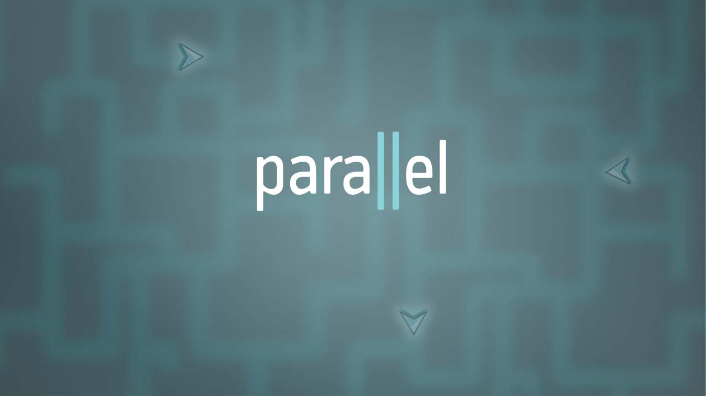

"Parallel" is an educational game to teach parallel and concurrent programming. It is being developed at Drexel University (funded by the Cyberlearning NSF grant 1523116).

Download the latest release <a href="https://github.com/santiontanon/Parallel/releases/">here</a>.

Notes:
- This project uses Unity 2018.1 and does not work on previous versions.
- This project requires Java version 7 or newer to run.
